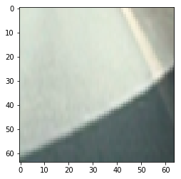

# Vehicle Detection

The Project
---

The goals / steps of this project are the following:

* Perform a Histogram of Oriented Gradients (HOG) feature extraction on a labeled training set of images and train a classifier Linear SVM classifier
* Optionally, you can also apply a color transform and append binned color features, as well as histograms of color, to your HOG feature vector. 
* Note: for those first two steps don't forget to normalize your features and randomize a selection for training and testing.
* Implement a sliding-window technique and use your trained classifier to search for vehicles in images.
* Run your pipeline on a video stream (start with the test_video.mp4 and later implement on full project_video.mp4) and create a heat map of recurring detections frame by frame to reject outliers and follow detected vehicles.
* Estimate a bounding box for vehicles detected.

## Loading Data
We load the data from a bin of car images and non-car images.

## Histogram of Oriented Gradients
A histogram of oriented gradients counts gradients in small areas of the image and takes the largest gradient, which gives a rough outline of the object. This can then be used to train the Linear SVM classifier. This is done in the function `get_hog_features` which utilizes the `skimage` library. This returns an array of features as well as an image. We also add a color histogram and spatial binning to improve results and have additional features to work with. Below is the HOG of the first car image.

  

The following HOG params were used, based on testing and the values given by udacity:
`color_space = 'LUV'  
orient = 8  
pix_per_cell = 8  
cell_per_block = 2  
hog_channel = 0  
spatial_size = (16, 16)  
hist_bins = 32`

## Train a classifier
We first create HOG feature arrays for both the set of car images and non-car images. We then use split off 20% of the data to use as test data. The LinearSVC is trained and achieves a test accuracy of 99% in 9 seconds. The State Vector Machine is used for classifying data.

## Sliding Window
Based on a window size and overlap, we search in the image for positive detections of cars. I had a default setting of 64x64 which was roughly the size of a car far away, but I also utilized different scales to search for cars that were closer. The scales used were 1, 1.25, 1.5, 1.75, which allowed for different sized cars. `search_windows()` took care of collecting positive detections, resizing the image appropriately, pulling out the features of that particular window, prediction, and then proper binning. 

## Heat Map
A heat map was used to keep track of where cars were over time, so that random outliers could be rejected. This also allowed to skip every second video frame. There is a user defined threshold that cuts off low-heat areas. I also implemented that we scan only in the left and right corners for new cars, and the rest is taken care of by the heat map.

## Discussion
The pipeline works decently well for the given video but is somewhat slow and would be too much of a performance hog if added to lane line detection and other functionality. It still might struggle with different lighting conditions and I suspect it would not work well with darker conditions. This could be fixed with increased training data, and perhaps better logic of where to search. 
